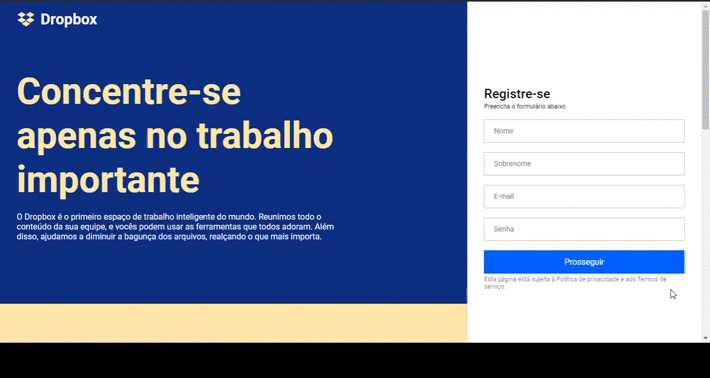

# UI Clone: Dropbox

<p align="center">:rocket: Clone da interface gráfica  da home page do Dropbox, implementado em React.
 Aplicação feita seguindo passos apresentados no vídeo tutorial da <a href="https://www.youtube.com/watch?v=VqP1ECc_j4M">RocketSeat</a>.
</p>

## :computer: Tecnologias
<ul>
  <li><a href="https://pt-br.reactjs.org/">React</a></li>
  <li><a href="https://styled-components.com/">Styled Components</a></li>
  <li><a href="https://react-icons.github.io/react-icons/">React Icons</a></li>
  <li><a href="https://styled-components.com/">Typescript</a></li>
</ul>

## :fire: Instalação

É necessário ter um ambiente NodeJS ou Yarn instalado em sua máquina

### Clonando o repositório:

```
$ git clone https://github.com/SobrinhoSergio/clone-dropbox-HomePage.git
```

### Executando

```bash
# Go to folder
$ cd dropbox-clone

# Install Dependencies
$ yarn install

# Run Aplication on Android
$ yarn start
```
- Executando em http://localhost:3000

## :white_check_mark: Resultado



---

<p align="center">Feito com 💜 por <strong>Sérgio de Souza Lima Sobrinho</a></strong> </p>
